# Redmine Indicator

## Summary

Add block with main indicator on my page and project page

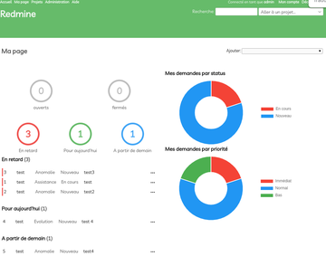

## Usage

On your page, can you add

- my issues by priority

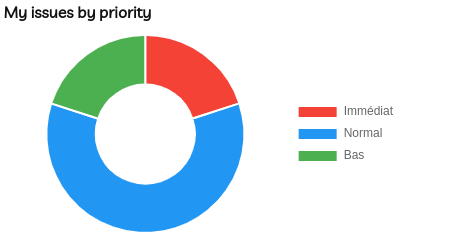

- my issues by status

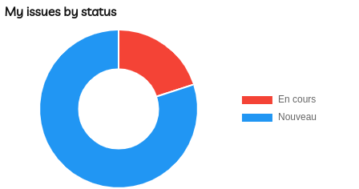

- my issues by tracker

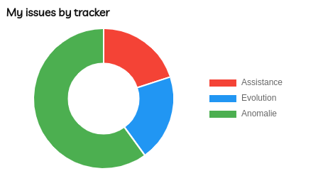

- my issues due

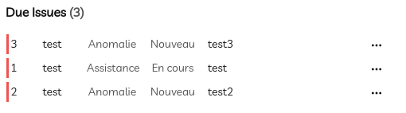

- my issues next

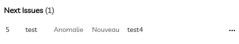

- my issues today

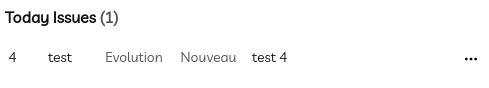

- my issues opened closed today

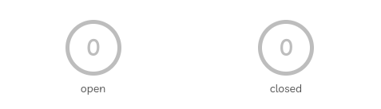

- my issues opened closed on 10 days

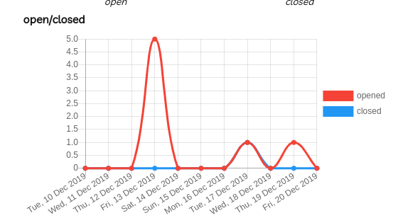

- - my issues opened closed on 10 weeks

- my issues summary

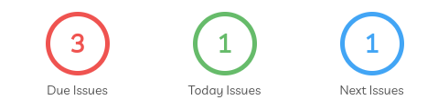


- my spent time on 10 days

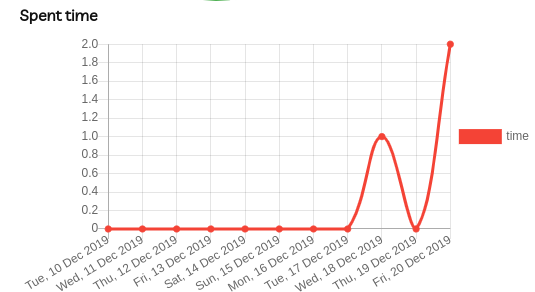

- my spent_time on 10 weeks

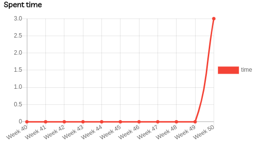


You can add same block in project's page "overview" with change value of custom field of projet:

- indicator_left_top
- indicator_left_bottom
- indicator_right

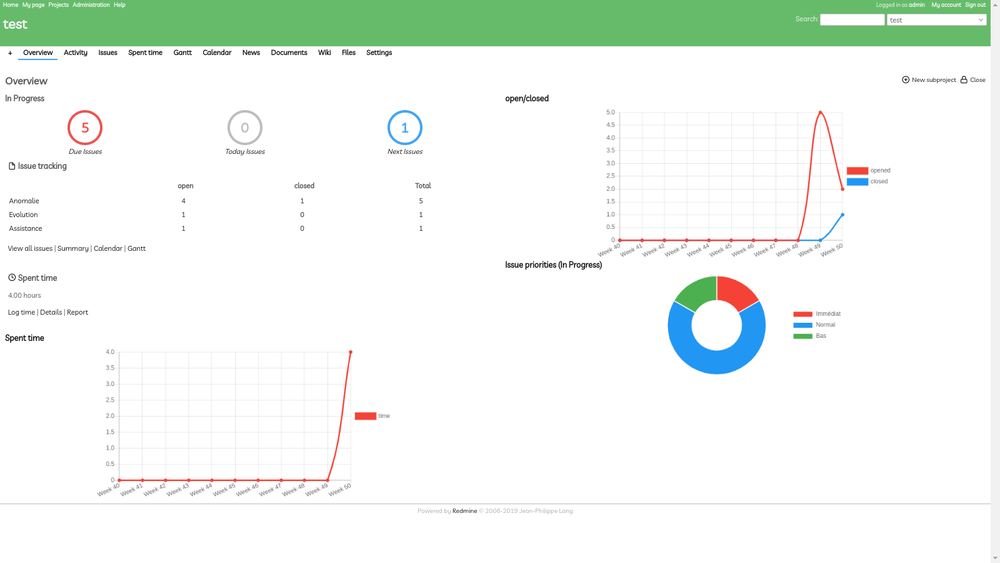

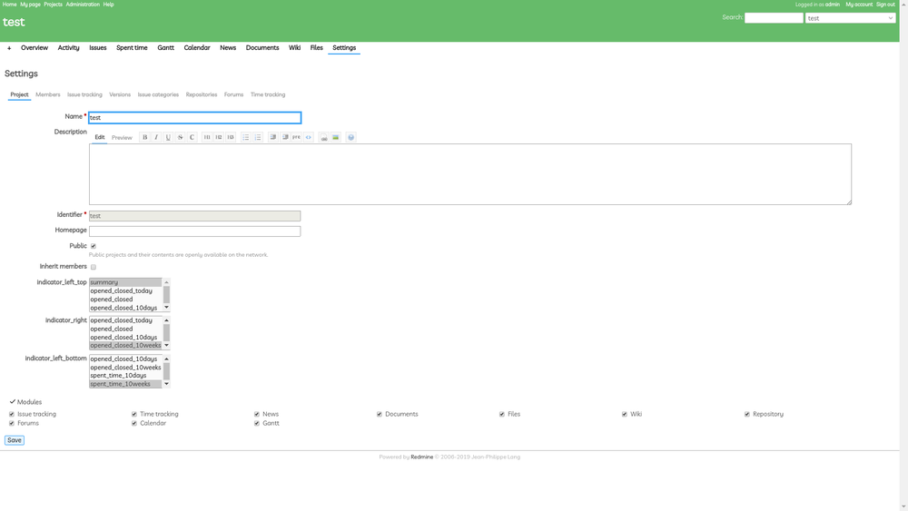


## Installation

```
$ cd redmine/plugins
$ git clone https://github.com/fraoustin/redmine_indicator.git
$ rake redmine:plugins:migrate NAME=redmine_indicator
```

restart Redmine

for uninstall, you can use

```
$ cd redmine/plugins
$ rake redmine:plugins:migrate NAME=redmine_indicator VERSION=0
```

